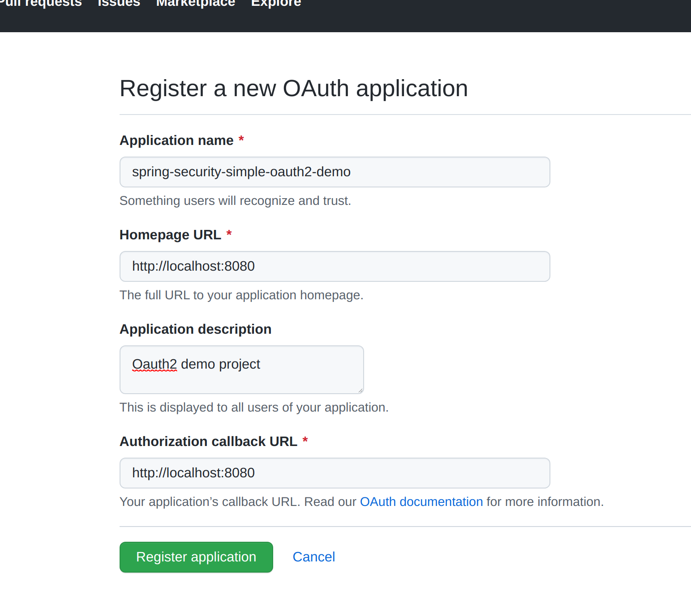

# Spring Security OAuth2 demo project

This is a demo project to show how to use GitHub as the oauth2 authroization server

Setup new client on GitHub

[GitHub](https://github.com/settings/applications/new)

Configuration

[Git Hub OAuth2 authorizing apps](https://docs.github.com/en/developers/apps/building-oauth-apps/authorizing-oauth-apps)

Implement ClientRegisteration for each provider ( GitHub , Goodgle , Facebook etc.) and ClientRegistrationRepository

http.oauth2Login();

May go with property based configuration with below

spring.security.oauth2.client.registration.github.client-id=
spring.security.oauth2.client.registration.github.client-secret=
spring.security.oauth2.client.provider.myprovider.authorization-uri=
spring.security.oauth2.client.provider.myprovider.token-uri=

###Authentication Work flow
* http://localhost:8080
* OAuth2 filter redirect it to for authenticatiion http://localhost:8080/oauth2/authorization/github
* To get AUthorization Token https://github.com/login/oauth/authorize?response_type=code&client_id=bf846d7c3ea0d351a643&scope=read:user&state=K2qrp5a_UodXFldl8nVQGb14rA2YXLsqO0zpwm80JrM%3D&redirect_uri=http://localhost:8080/login/oauth2/code/github
 
* Github calls back http://localhost:8080/login/oauth2/code/github?code=a835ee1db24495b460d9&state=K2qrp5a_UodXFldl8nVQGb14rA2YXLsqO0zpwm80JrM%3D , client app gets access token here

>>The details of authentication is populated
>>2021-08-29 17:39:56.337 DEBUG 25008 --- [nio-8080-exec-9] .s.o.c.w.OAuth2LoginAuthenticationFilter : Set SecurityContextHolder to OAuth2AuthenticationToken [Principal=Name: [11564697], Granted Authorities: [[ROLE_USER, SCOPE_read:user]], User Attributes: [{login=springland, id=11564697, node_id=MDQ6VXNlcjExNTY0Njk3, avatar_url=https://avatars.githubusercontent.com/u/11564697?v=4, gravatar_id=, url=https://api.github.com/users/springland, html_url=https://github.com/springland, followers_url=https://api.github.com/users/springland/followers, following_url=https://api.github.com/users/springland/following{/other_user}, gists_url=https://api.github.com/users/springland/gists{/gist_id}, starred_url=https://api.github.com/users/springland/starred{/owner}{/repo}, subscriptions_url=https://api.github.com/users/springland/subscriptions, organizations_url=https://api.github.com/users/springland/orgs, repos_url=https://api.github.com/users/springland/repos, events_url=https://api.github.com/users/springland/events{/privacy}, received_events_url=https://api.github.com/users/springland/received_events, type=User, site_admin=false, name=null, company=null, blog=, location=null, email=null, hireable=null, bio=null, twitter_username=null, public_repos=12, public_gists=0, followers=0, following=0, created_at=2015-03-20T01:02:07Z, updated_at=2021-08-24T11:10:19Z, private_gists=0, total_private_repos=0, owned_private_repos=0, disk_usage=141, collaborators=0, two_factor_authentication=false, plan={name=free, space=976562499, collaborators=0, private_repos=10000}}], Credentials=[PROTECTED], Authenticated=true, Details=WebAuthenticationDetails [RemoteIpAddress=0:0:0:0:0:0:0:1, SessionId=9C0BC99411AE400AA399C4AD70B1A36A], Granted Authorities=[ROLE_USER, SCOPE_read:user]]  
* http://localhost:8080 to get content

2021-08-29 17:39:55.683 TRACE 25008 --- [nio-8080-exec-7] o.s.security.web.FilterChainProxy        : Invoking FilterSecurityInterceptor (15/15)
2021-08-29 17:39:55.683 TRACE 25008 --- [nio-8080-exec-7] o.s.s.w.a.i.FilterSecurityInterceptor    : Did not re-authenticate AnonymousAuthenticationToken [Principal=anonymousUser, Credentials=[PROTECTED], Authenticated=true, Details=WebAuthenticationDetails [RemoteIpAddress=0:0:0:0:0:0:0:1, SessionId=null], Granted Authorities=[ROLE_ANONYMOUS]] before authorizing
2021-08-29 17:39:55.683 TRACE 25008 --- [nio-8080-exec-7] o.s.s.w.a.i.FilterSecurityInterceptor    : Authorizing filter invocation [GET /] with attributes [authenticated]
2021-08-29 17:39:55.684 TRACE 25008 --- [nio-8080-exec-7] o.s.s.w.a.expression.WebExpressionVoter  : Voted to deny authorization
2021-08-29 17:39:55.684 TRACE 25008 --- [nio-8080-exec-7] o.s.s.w.a.i.FilterSecurityInterceptor    : Failed to authorize filter invocation [GET /] with attributes [authenticated] using AffirmativeBased [DecisionVoters=[org.springframework.security.web.access.expression.WebExpressionVoter@2b0dc227], AllowIfAllAbstainDecisions=false]
2021-08-29 17:39:55.685 TRACE 25008 --- [nio-8080-exec-7] o.s.s.w.a.ExceptionTranslationFilter     : Sending AnonymousAuthenticationToken [Principal=anonymousUser, Credentials=[PROTECTED], Authenticated=true, Details=WebAuthenticationDetails [RemoteIpAddress=0:0:0:0:0:0:0:1, SessionId=null], Granted Authorities=[ROLE_ANONYMOUS]] to authentication entry point since access is denied

encrypt.sh input="Input" algorithm=PBEWithMD5AndDES password=password
decrypt.sh input="Input" password=password algorithm=PBEWithMD5AndDES